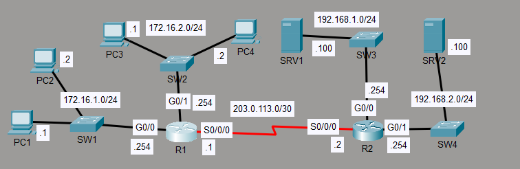

# Extended ACL Configuration Lab

This lab demonstrates traffic filtering using extended access control lists in Cisco Packet Tracer.

## Overview
Configured extended ACLs to control traffic based on source IP, destination IP, and protocol, simulating real-world network security policies.

## Skills Demonstrated
- Extended ACL Configuration
- Traffic Filtering
- Cisco CLI
- Network Verification
- Network Troubleshooting

## Topology

## Key Configuration
- Configured extended ACLS to fulfill the following network policies:
      -Hosts in 172.16.2.0/24 can't communicate with PC1.
      -Hosts in 172.16.1.0/24 can't access the DNS service on SRV1.
      -Hosts in 172.16.2.0/24 can't access the HTTP or HTTPS services on SRV2.
- Applied ACLs to interfaces in the correct direction (inbound/outbound)
- Controlled traffic based on IP addresses and protocols

## Verification
- Verified ACL entries using:
  - show access-lists
- Verified interface application using:
  - show ip interface
- Confirmed permitted traffic passed successfully
- Confirmed denied traffic was blocked as expected

## Technologies Used
- Cisco Packet Tracer
- Extended ACLs
- IPv4 Networking

## Author
Mustafa Albazzaz – CCNA Certified
